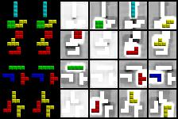

# Slot-Attention
This is a minimalistic PyTorch implementation of [Object-Centric Learning with Slot Attention](https://arxiv.org/pdf/2006.15055.pdf) for Tetrominoes dataset.
#### Update: 
Added functionality for Implicit slot-attention method as proposed in paper [Object Representations as Fixed Points: Training Iterative Refinement Algorithms with Implicit Differentiation](https://arxiv.org/pdf/2207.00787.pdf)

# Training Results
Below are the slot visualizations of sample test_images after training for 100k steps

Left to right: Input, reconstruction and 4 slots are visualized for each sample test_image.

# Data
This repo trained Slot Attention only on Tetrominoes dataset which is part of Google Multi-Object Datasets and is available as TFRecords here: https://github.com/deepmind/multi_object_datasets.

This code uses only `h5py` versions of this dataset that @pemami4911 created by modifying the TFRecords; which are available here [Dropbox link](https://www.dropbox.com/s/y95oyh3cxl8nk5h/clevr6_with_masks_train.h5?dl=0) for download. ( tetrominoes.h5 and tetrominoes_test.h5 )

# Usage 
Training with default hyperparameters (for hyperparams check argparser in main.py) for Tetrominoes Dataset

`python main.py --train`

For training implicit slot-attention as proposed in [Object Representations as Fixed Points: Training Iterative Refinement Algorithms with Implicit Differentiation](https://arxiv.org/pdf/2207.00787.pdf)

`python main.py --train --use_implicit_grads`

For testing on validation data 

`python main.py --test`

For visualizing slots of sample images 

`python main.py --visualize`
